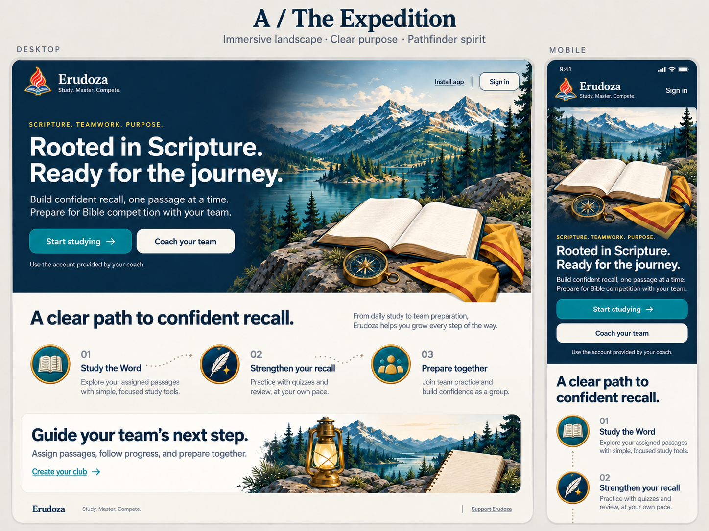
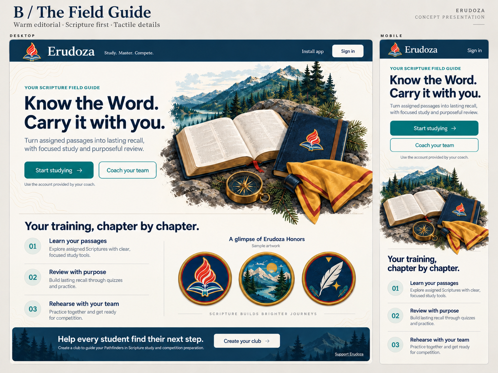
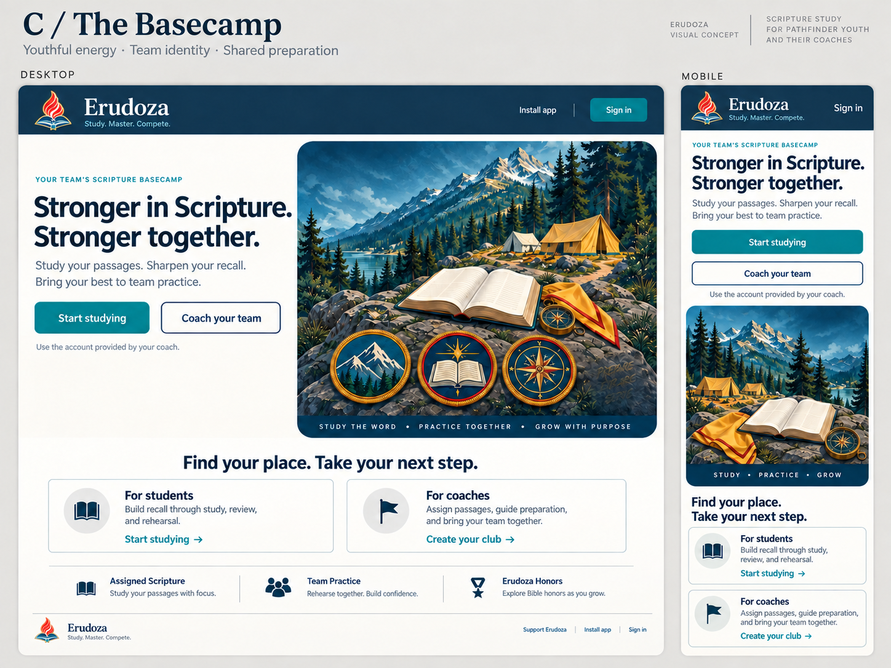

# Erudoza Pathfinder landing page concepts

September 12, 2026 · Selected: A with B’s middle section

The user selected Option A’s hero and coach panel, then supplied [the preferred middle section](selected-middle-section.png): numbered training steps beside three sample Honors. This combination is now implemented on the task branch. The original boards below remain unchanged as design references. See the [implementation audit](../../../audits/2026-09-12-pathfinder-landing.md) and [production artwork package](../../../brand/2026-09-12-landing-expedition/README.md).

Three visual proposals for the existing public landing page, each showing a desktop composition and a phone composition. Generated with the built-in image generation tool using the approved Erudoza emblem, landscape, field-guide illustration, and patch texture as references. The complete initial and refinement prompts are in [prompts.json](prompts.json).

## A — The Expedition (selected)

An integrated navy-and-landscape hero, a short trail through study/review/team preparation, and a coach invitation. Strongest sense of adventure and the clearest visual departure from the current banner-over-copy layout. The taller illustrated phone hero trades immediate content density for atmosphere.

## B — The Field Guide

An airy ivory layout with Scripture, a navy journal, compass, and neckerchief. An editorial numbered training index and sample patch display. Best for a calm, personal study identity; less dramatic than A.

## C — The Basecamp

A contained camp illustration with decorative patches, a message about preparing together, and clear student/coach pathways. Best for club identity and teamwork; the theme depends more on the illustration than A’s full hero composition.

## Original concept boundaries

- These boards are raster composition proposals. The generated phone views illustrate layout intent; they are not evidence of a tested responsive implementation. The later implementation has its own verification in the linked audit.
- Current public page was inspected at https://erudoza.com/ and source checked in LandingPage.tsx, DESIGN.md, and the semantic tokens. No application source, shared styles, authentication flow, support preference, or live deployment changed.
- Preserve the typeset Erudoza name and use the exact approved emblem at implementation. Generated drawings are visual references, not replacements for the production logo or Scripture text.
- Interface headings remain system sans; serif is reserved for branding and Scripture. Refined boards correct the initial serif section headings and retain visible mobile sign-in.
- Student and existing coach entry continue to /login; new coach club creation continues to /signup. Install app follows existing browser availability. Any final support placement must retain the existing support/minimize/restore behavior.
- Honor images are sample/decorative artwork, not new earned criteria, official Pathfinder certification, or a proposed gameplay change. Do not render raster Bible-page text as actual Scripture.
- Final implementation should use shared primitives in apps/web/src/components/ui/index.tsx and semantic tokens in apps/web/src/styles/tokens.css, then verify real desktop and 390/320px behavior and accessibility.
- Selection completed: A’s hero and coach panel with B’s middle section.

Validation: all three refined boards were visually inspected for desktop/phone layout, text hierarchy, brand cues, and the requested corrections. PNG dimensions/hashes, source-copy equivalence, local document links, JSON syntax, and Git whitespace are checked at the review checkpoint. No application test result, CI pass, or deployment is implied.
